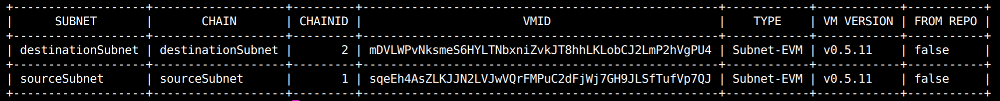

# Avalanche Hack House 07/10/2024

## Project description

Use of ITCC lib to build a vault on the destination chain to send tokens and retrieve them without all from the source chain.

This project uses the `SendAndCall` function from the `IERC20TokenTransferrer.sol` interface.

## Vault contract

The vault contract implement the function from `IERC20SendAndCallReceiver.sol` interface to receive the message and then, depedending on the content of the message, deposit some tokens on itself or bridge some tokens back to the source chain.

## Flow

First you need to start your network, create the subnets and deploy them. For that, I used the `avalanche cli`:

```bash
avalanche network start
avalanche subnet create sourceSubnet
avalanche subnet create destinationSubnet
```



Then you need to deploy the ERC20 token and the bridges:

```bash
forge create --rpc-url $SRC_CHAIN_RPC --private-key $EWOQ_PRIV_KEY src/RandomToken.sol:RandomToken --json
```

```bash
forge script --rpc-url "$SRC_CHAIN_RPC" \
  --private-key "$EWOQ_PRIV_KEY" \
  script/DeployERC20TokenHome.s.sol:DeployERC20TokenHome \
  --broadcast --skip-simulation

forge script --rpc-url "$DEST_CHAIN_RPC" \
  --private-key "$EWOQ_PRIV_KEY" \
  script/DeployERC20TokenRemote.s.sol:DeployERC20TokenRemote \
  --broadcast --skip-simulation
```

Then you can call the `sendAndCall` function from the source chain:

```bash
cast send --rpc-url "$SRC_CHAIN_RPC" --json \
  --private-key "$EWOQ_PRIV_KEY" \
  "$BRIDGE_HOME" \
  'send((bytes32,address,address,bytes,uint256,uint256,address,address,address,uint256,uint256),uint256)' \
  "($DEST_CHAIN_ID,$BRIDGE_REMOTE,$VAULT_REMOTE,$PAYLOAD,$REQ_GAS_LIMIT,$REC_GAS_LIMIT,$MULTIHOP_FALLBACK,$FALLBACK_REC,$PRIMARY_FEE_TOKEN,0,0)" "10000000000000000000"
```

You need to abi-encode the $PAYLOAD. For that, you can go to this (site)[https://abi.hashex.org/]. The parameters are as follow:

```bash
address senderAddress,
uint256 tokenAmount,
bool addToMapping
```

The boolean variable, if true, tells the vault to add the tokens to the mapping and, if false, tells the vault to bridge back the tokens.

Note that this is not secured because anyone with your address could retrieve your tokens locked in the vault.
